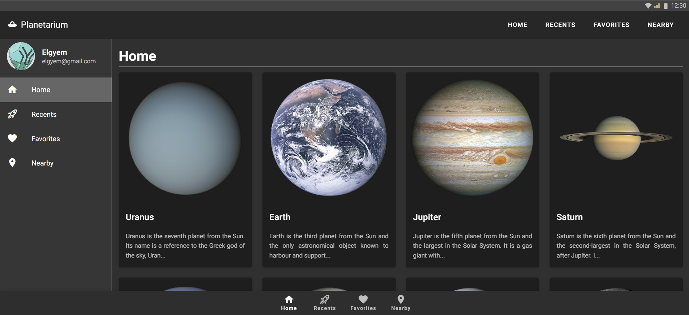
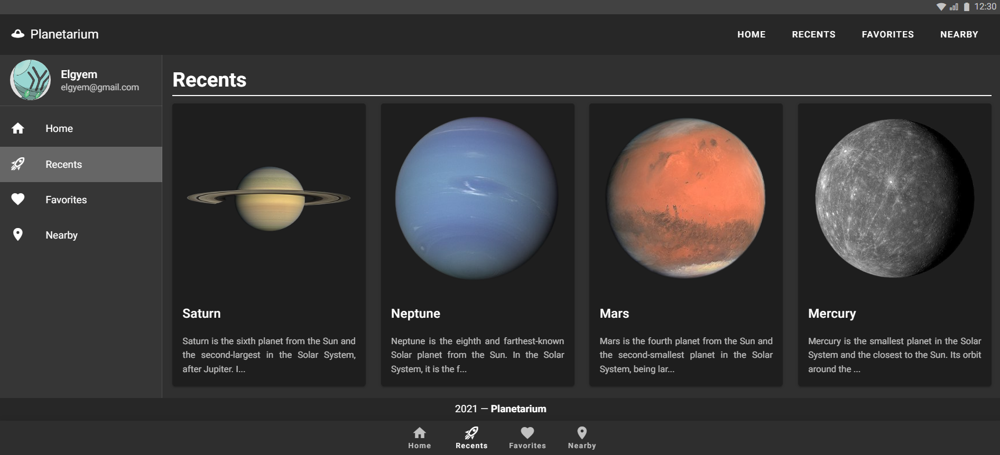
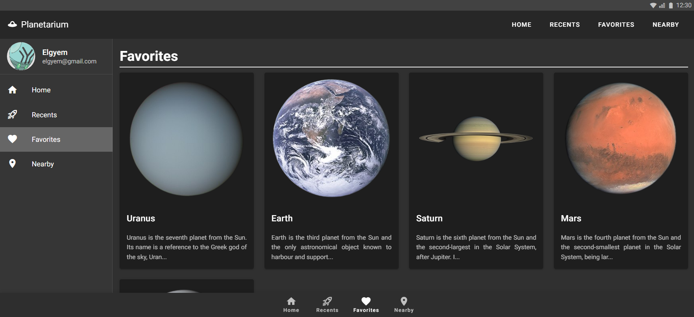
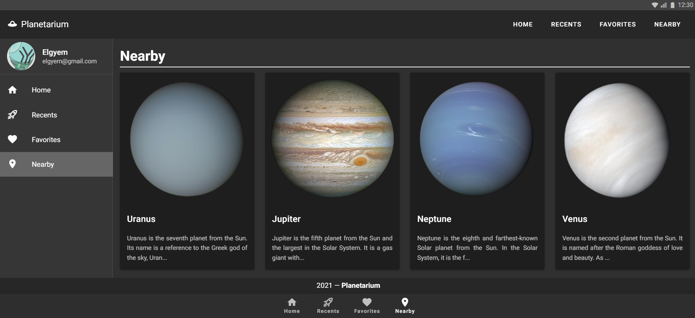
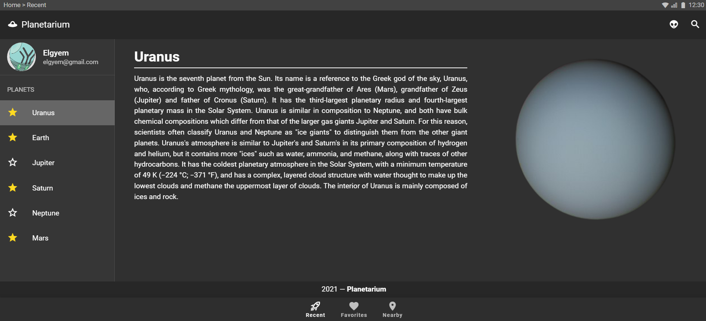

# 🪐 Planetarium
AF2/AF3 - Final Result:

- Home Screen
<p align="center">

</p>

- Recents Screen
<p align="center">

</p>

- Favorites Screen
<p align="center">

</p>

- Nearby Screen
<p align="center">

</p>


AF1 - Final result:
<p align="center">

</p>

## 💻 Running The Project
Firstly, clone the repository with the command:
```bash
git clone https://github.com/leoruas/web-af.git
```

Once the repository is cloned, navigate to the cloned folder and install the necessary dependencies with:
```bash
cd web-af

npm install
``` 

Once the installation is finished you can run the project by running the command:
```bash
npm run serve
```